# 软件说明书（中期 / 结项共用主文档）

---

## 基本信息

**项目名称：** 学友圈（Study Buddy Hub）——跨专业学习交流平台  
**学    院：** 计算机学院  
**小组序号：** 第34组  
**成员姓名：** 刘枭 / 蒋钟贤 / 龙旋 / 尹明喆 / 申宇杰  
**指导老师：** 尹兆远  
**当前版本：** 中期版  
**更新日期：** 2026年4月26日  

---

## 一、项目概述  

### 1. 项目背景
在当前高校环境中，不同专业学生之间普遍存在“信息茧房”现象：计算机学生难以找到设计专业的UI支持，文科学生需要理科生辅导数学建模，创新创业团队难以组建跨专业队伍。传统的QQ群、贴吧等方式存在信息杂乱、匹配效率低、沟通成本高等问题。  
“学友圈”项目旨在建立一个面向大学生的轻量级跨专业学习交流平台，打破专业壁垒，连接知识孤岛。

### 2. 系统目标
构建一个Web端最小可行产品（MVP），实现以下核心目标：
- 支持学生注册/登录。
- 允许学生发布学习需求或合作邀请。
- 实现基础管理功能（如管理员删帖）。

### 3. 开发环境
- **开发工具**：VS Code（前端）、IntelliJ IDEA（后端）、Git（版本控制）、DBeaver（数据库管理）
- **运行环境**：JDK 11、Node.js 16+、浏览器（Chrome/Edge）
- **数据库**：MySQL 8.0
- **代码托管**：GitHub（https://github.com/idleishen/StudyBuddyHub）

---

## 二、需求分析  

### 1. 功能需求
| 模块 | 功能 | 描述 |
|------|------|------|
| 用户管理 | 注册/登录 | 学号验证、密码加密存储 |
| 需求发布 | 发布帖子 | 标题、内容|
| | 帖子列表与筛选 | 按发布时间倒序|
| 管理员 | 管理用户/帖子 | 封禁用户、删除违规帖子 |

### 2. 非功能需求
- **性能要求**：页面加载时间 < 3秒（开发环境）；消息延迟 < 1秒。
- **安全要求**：密码BCrypt加密。
- **兼容性要求**：支持Chrome、Edge最新版本，PC端为主。  

---

## 三、系统设计  

### 1. 系统架构

采用前后端分离架构：

- **前端**：Vue 3 + Element Plus，通过 HTTP 请求后端 RESTful API，WebSocket 用于实时消息通信。
- **后端**：Spring Boot + MyBatis，提供 RESTful API 接口，处理业务逻辑与数据持久化。
- **数据库**：MySQL 8.0，存储用户、帖子、标签、消息等核心数据。
- **版本控制**：Git，托管于 GitHub（https://github.com/idleishen/StudyBuddyHub.git）。

**架构图**：

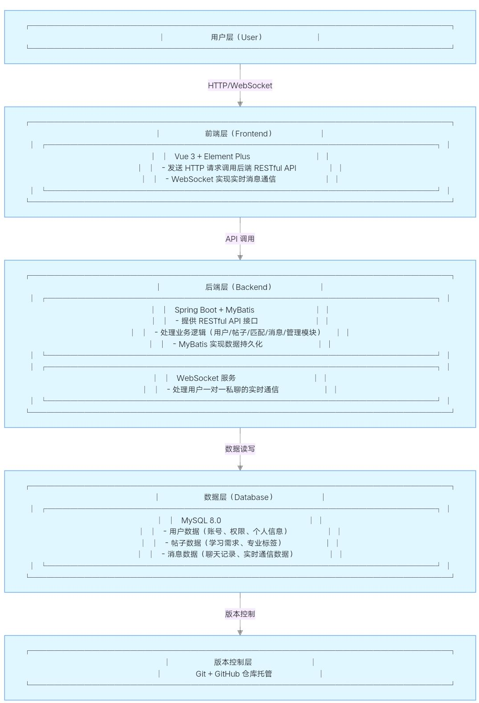

### 2. 模块设计

系统主要划分为以下模块：

| 模块名称 | 职责说明 |
|----------|----------|
| **用户模块** | 用户注册、登录、个人信息管理，JWT 认证与权限分级（普通用户/管理员） |
| **帖子模块** | 学习需求帖子的发布、编辑、删除|
| **管理模块** | 管理员对帖子进行审核，对用户进行管理 |

### 3. 数据库设计
#### E-R 图
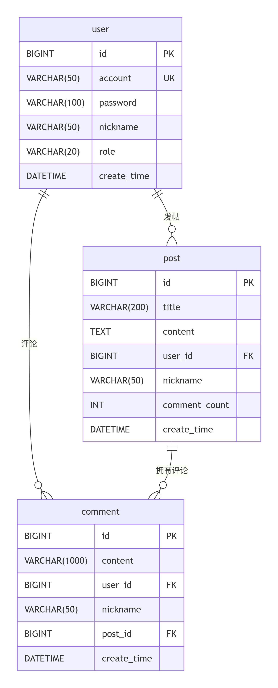
### 主要数据表

本系统数据库名为 `xueyouquan`，采用 UTF-8 编码，共包含 3 张核心业务表。

#### 用户表（user）

| 字段名 | 数据类型 | 约束 | 说明 |
|--------|----------|------|------|
| id | BIGINT | PRIMARY KEY, AUTO_INCREMENT | 用户ID |
| account | VARCHAR(50) | NOT NULL, UNIQUE | 登录账号 |
| password | VARCHAR(100) | NOT NULL | 加密后的密码 |
| nickname | VARCHAR(50) | NOT NULL | 用户昵称 |
| role | VARCHAR(20) | DEFAULT 'USER' | 角色：USER 或 ADMIN |
| create_time | DATETIME | DEFAULT CURRENT_TIMESTAMP | 注册时间 |

#### 帖子表（post）

| 字段名 | 数据类型 | 约束 | 说明 |
|--------|----------|------|------|
| id | BIGINT | PRIMARY KEY, AUTO_INCREMENT | 帖子ID |
| title | VARCHAR(200) | NOT NULL | 帖子标题 |
| content | TEXT | NOT NULL | 帖子正文内容 |
| user_id | BIGINT | NOT NULL, FOREIGN KEY | 发帖用户ID，关联 user 表 |
| nickname | VARCHAR(50) | DEFAULT NULL | 发帖人昵称（冗余字段） |
| comment_count | INT | DEFAULT 0 | 评论总数 |
| create_time | DATETIME | DEFAULT CURRENT_TIMESTAMP | 发布时间 |

#### 评论表（comment）

| 字段名 | 数据类型 | 约束 | 说明 |
|--------|----------|------|------|
| id | BIGINT | PRIMARY KEY, AUTO_INCREMENT | 评论ID |
| content | VARCHAR(1000) | NOT NULL | 评论正文 |
| user_id | BIGINT | NOT NULL, FOREIGN KEY | 评论者ID，关联 user 表 |
| nickname | VARCHAR(50) | DEFAULT NULL | 评论者昵称（冗余字段） |
| post_id | BIGINT | NOT NULL, FOREIGN KEY | 所属帖子ID，关联 post 表 |
| create_time | DATETIME | DEFAULT CURRENT_TIMESTAMP | 评论时间 |

---

## 四、系统实现  

### 1. 关键技术
- **后端**：Spring Boot 自动配置、MyBatis 动态SQL。
- **前端**：Vue 3 组合式 API、Element Plus 组件库。
- **安全性**：JWT 用户认证、BCrypt 密码加密。


### 2. 界面展示
#### 页面图
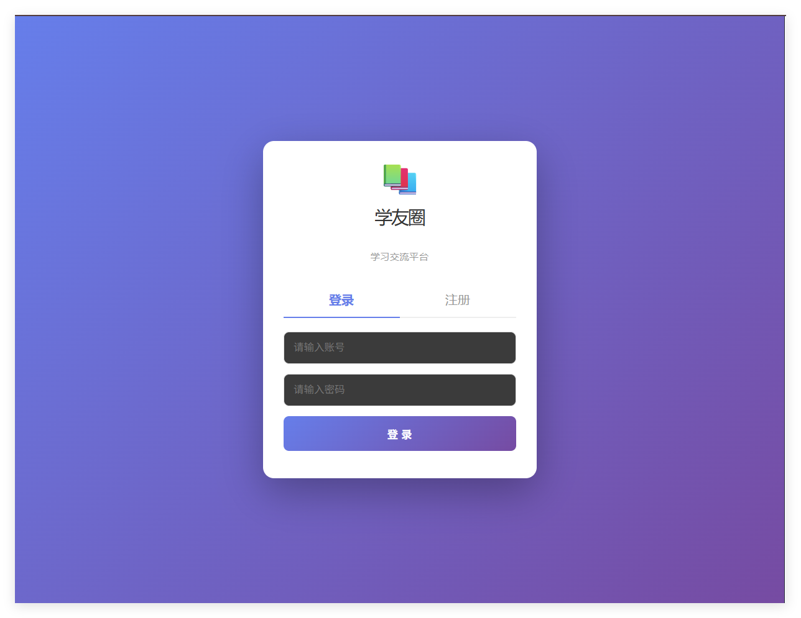
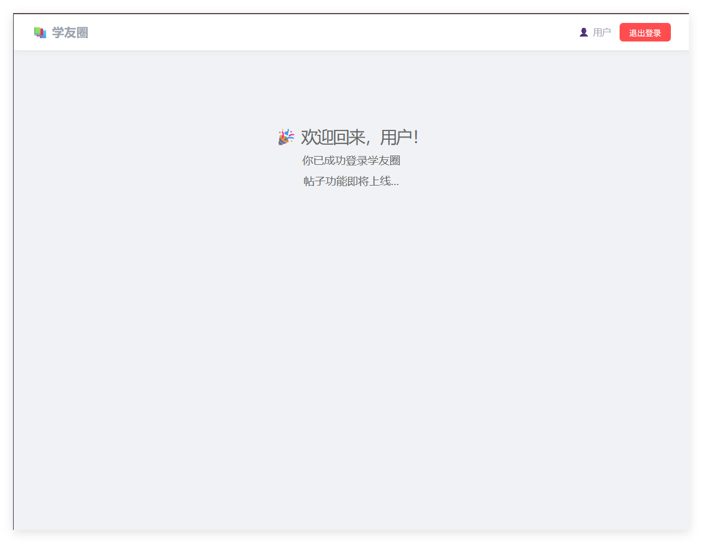
### 3. 核心代码片段

**主运行类：AfterendApplication.java**

```java
package com.afterend;

import org.springframework.boot.SpringApplication;
import org.springframework.boot.autoconfigure.SpringBootApplication;

@SpringBootApplication
public class AfterendApplication {
    public static void main(String[] args) {
        SpringApplication.run(AfterendApplication.class, args);
        System.out.println("学友圈启动成功！");
    }
}
```
**统一响应结果类（Result.java）**

```java
package com.afterend.common;

public class Result<T> {
    private Integer code;
    private String message;
    private T data;

    public Integer getCode() { return code; }
    public void setCode(Integer code) { this.code = code; }

    public String getMessage() { return message; }
    public void setMessage(String message) { this.message = message; }

    public T getData() { return data; }
    public void setData(T data) { this.data = data; }

    // 成功响应（带数据）
    public static <T> Result<T> success(T data) {
        Result<T> result = new Result<>();
        result.setCode(200);
        result.setMessage("操作成功");
        result.setData(data);
        return result;
    }

    // 失败响应（带错误信息）
    public static <T> Result<T> error(String message) {
        Result<T> result = new Result<>();
        result.setCode(500);
        result.setMessage(message);
        return result;
    }
}
```

> **说明**：该泛型类封装了统一响应格式（code + message + data），所有 Controller 接口均返回此对象，方便前端统一解析处理。

**全局配置类（WebConfig.java）**

```java
package com.afterend.config;

import com.afterend.interceptor.LoginInterceptor;
import org.springframework.beans.factory.annotation.Autowired;
import org.springframework.context.annotation.Configuration;
import org.springframework.web.servlet.config.annotation.CorsRegistry;
import org.springframework.web.servlet.config.annotation.InterceptorRegistry;
import org.springframework.web.servlet.config.annotation.WebMvcConfigurer;

@Configuration
public class WebConfig implements WebMvcConfigurer {

    @Autowired
    private LoginInterceptor loginInterceptor;

    // 配置跨域（允许 Vue 前端调用后端接口）
    @Override
    public void addCorsMappings(CorsRegistry registry) {
        registry.addMapping("/**")
                .allowedOrigins("http://localhost:5173")
                .allowedMethods("*")
                .allowedHeaders("*");
    }

    // 注册登录拦截器（注册和登录接口除外）
    @Override
    public void addInterceptors(InterceptorRegistry registry) {
        registry.addInterceptor(loginInterceptor)
                .addPathPatterns("/**")
                .excludePathPatterns("/api/user/register", "/api/user/login");
    }
}
```

> **说明**：该类实现全局 CORS 跨域配置，允许 Vue 前端（端口 5173）访问后端接口；同时注册 `LoginInterceptor`，仅放行注册和登录接口，其余接口需校验 JWT Token。
**用户数据访问层（UserMapper.java）**

```java
package com.afterend.mapper;

import com.afterend.entity.User;
import org.apache.ibatis.annotations.*;

@Mapper
public interface UserMapper {
    // 新增用户（默认角色为 USER）
    @Insert("INSERT INTO user(account, password, nickname, role) VALUES(#{account}, #{password}, #{nickname}, 'USER')")
    @Options(useGeneratedKeys = true, keyProperty = "id")
    int insert(User user);

    // 根据账号查询用户
    @Select("SELECT * FROM user WHERE account = #{account}")
    User findByAccount(String account);

    // 根据ID查询用户
    @Select("SELECT * FROM user WHERE id = #{id}")
    User findById(Long id);
}
```
**帖子数据访问层（PostMapper.java）**

```java
package com.afterend.mapper;

import com.afterend.entity.Post;
import org.apache.ibatis.annotations.*;
import java.util.List;

@Mapper
public interface PostMapper {
    // 新增帖子
    @Insert("INSERT INTO post(title, content, user_id, nickname) VALUES(#{title}, #{content}, #{userId}, #{nickname})")
    @Options(useGeneratedKeys = true, keyProperty = "id")
    void insert(Post post);

    // 查询全部帖子（按时间倒序）
    @Select("SELECT * FROM post ORDER BY create_time DESC")
    List<Post> findAll();

    // 根据ID查询帖子详情
    @Select("SELECT * FROM post WHERE id = #{id}")
    Post findById(Long id);

    // 根据ID删除帖子
    @Delete("DELETE FROM post WHERE id = #{id}")
    void deleteById(Long id);
}
```
**评论功能数据访问层（CommentMapper.java）**

```java
package com.afterend.mapper;

import com.afterend.entity.Comment;
import org.apache.ibatis.annotations.*;
import java.util.List;

@Mapper
public interface CommentMapper {
    // 新增评论
    @Insert("INSERT INTO comment(content, user_id, nickname, post_id) VALUES(#{content}, #{userId}, #{nickname}, #{postId})")
    @Options(useGeneratedKeys = true, keyProperty = "id")
    void insert(Comment comment);

    // 根据帖子ID查询评论（按创建时间升序）
    @Select("SELECT * FROM comment WHERE post_id = #{postId} ORDER BY create_time ASC")
    List<Comment> findByPostId(Long postId);

    // 根据ID删除评论
    @Delete("DELETE FROM comment WHERE id = #{id}")
    void deleteById(Long id);
}
```
**JWT 登录拦截器（LoginInterceptor.java）**

```java
package com.afterend.interceptor;

import com.afterend.util.JwtUtil;
import jakarta.servlet.http.HttpServletRequest;
import jakarta.servlet.http.HttpServletResponse;
import org.springframework.stereotype.Component;
import org.springframework.web.servlet.HandlerInterceptor;

@Component
public class LoginInterceptor implements HandlerInterceptor {
    @Override
    public boolean preHandle(HttpServletRequest request, HttpServletResponse response, Object handler) throws Exception {
        // 放行 OPTIONS 预检请求
        if ("OPTIONS".equals(request.getMethod())) {
            return true;
        }
        // 从请求头获取 token
        String token = request.getHeader("token");
        if (token == null || token.isEmpty()) {
            response.setStatus(401);
            return false;
        }
        try {
            // 解析 token 获取用户信息
            Long userId = JwtUtil.getUserId(token);
            String role = JwtUtil.getRole(token);
            request.setAttribute("userId", userId);
            request.setAttribute("role", role);
            return true;
        } catch (Exception e) {
            response.setStatus(401);
            return false;
        }
    }
}
```
---
## 五、系统测试

### 1. 测试方案

#### 测试方法

- **黑盒测试**：采用手工执行方式，不关注内部实现逻辑，仅验证系统输入与输出是否符合需求。
- **功能覆盖测试**：覆盖用户完整使用路径，从注册、登录到发帖、评论及权限控制。

#### 测试范围

| 测试模块 | 测试内容 |
|----------|----------|
| 用户模块 | 用户注册、登录、账号唯一性校验、密码大小写与空格校验 |
| 帖子模块 | 发布帖子、帖子非空校验、帖子排序、帖子删除（管理员） |
| 评论模块 | 发表评论、评论非空校验、评论删除（管理员）、回车快捷发送 |
| 分页模块 | 每页10条数据、翻页功能、边界控制（首页禁用上一页） |
| 权限模块 | 管理员权限验证、普通用户权限限制 |
| 接口验证 | 后端接口连通性、数据库连接状态 |

#### 测试工具

| 工具 | 用途 |
|------|------|
| IntelliJ IDEA | 后端代码查看与调试 |
| Chrome / Edge | 前端功能与界面测试 |
| MySQL Workbench | 数据库状态检查 |
| 浏览器开发者工具 | 前端请求与控制台错误排查 |

#### 测试用例设计（登录与注册）

**用户注册测试用例**
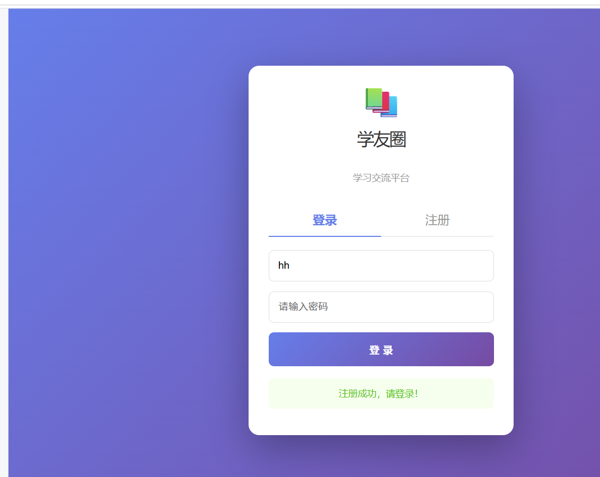

**用户登录测试用例**


> 完整测试用例见 `docs/report/测试文件夹`。

---

### 2. 测试结果

| 测试模块 | 用例数量 | 通过数 | 失败数 | 通过率 | 结论 |
|----------|:--------:|:------:|:------:|:------:|------|
| 用户注册 | 5 | 5 | 0 | 100% | 功能正常，账号唯一性校验生效 |
| 用户登录 | 5 | 5 | 0 | 100% | 登录态与角色展示正确 |
| 发帖功能 | 3 | 3 | 0 | 100% | 标题/正文非空校验有效 |
| 评论功能 | 3 | 3 | 0 | 100% | 评论顺序与删除权限正确 |
| 分页功能 | 1 | 1 | 0 | 100% | 分页逻辑与边界控制正常 |
| 权限控制 | 2 | 2 | 0 | 100% | 管理员/普通用户权限隔离严格 |
| 接口测试 | 1 | 1 | 0 | 100% | 后端接口与数据库连接正常 |

**总体结论**：  
本次测试共执行 **20 条**功能用例，**全部通过**，系统核心业务流程稳定，权限控制有效，接口与数据库运行正常，满足基本上线使用要求。

> 详细测试数据与截图见 `docs/report/测试文件夹`。

### 3. 问题与改进
**1.对于注册开始时，显示注册条件少了，后面加上了，没有截图**


**2.无法注册**


**解决方法：通过解析发现是数据库没有连接和注册条件增加**

---

## 六、用户手册  
### 6.1 用户注册与登录
#### ▶ 注册流程
1. 打开前端页面，自动进入登录页 → 点击「注册」标签；
2. 填写信息：
    - **账号**：唯一（不可与其他用户重复，支持中文，区分大小写，空格会计入校验）；
    - **密码**：任意字符（注意空格会被识别为有效内容）；
    - **昵称**：可自定义，无唯一性限制；
3. 点击「注册」→ 提示“注册成功，请登录！”即完成。

#### ▶ 登录流程
1. 输入已注册的账号+密码 → 点击「登录」；
2. 登录成功提示后自动跳转首页：
    - 管理员：顶部显示「👤 管理员」+ 红色“管理员”标签；
    - 普通用户：无管理标签。

---

### 6.2 帖子发布与管理
#### ▶ 发布帖子
1. 登录后进入首页 → 找到发帖区域；
2. 填写**标题**（如“如何成为一个优秀的程序员”）和**正文**（如“hello world！”）→ 两者均不可为空（空内容会触发提醒）；
3. 点击「发布帖子」→ 提示“发布成功！”即完成，新帖子显示在列表顶部（按发布时间倒序）。

#### ▶ 查看帖子详情
- 点击任意帖子卡片 → 弹出详情弹窗，可查看完整标题、发布者昵称、发布时间、正文；
- 关闭弹窗：点击右上角「✕」或弹窗外部灰色区域。

#### ▶ 删除帖子（仅管理员）
1. 打开帖子详情弹窗 → 可见红色「删除此帖」按钮；
2. 点击后弹出确认框：
    - 选「确定」：帖子立即删除，列表同步更新；
    - 选「取消」：关闭确认框，帖子保留。

---

### 6.3 评论互动
#### ▶ 发表评论
1. 打开帖子详情弹窗 → 在评论输入框输入内容（如“写得很好！”）→ 不可为空（空内容点击发表无反应）；
2. 发送方式：
    - 点击「发表」按钮；
    - 输入后按「回车键」；
3. 评论成功后会显示在评论列表，按发布时间顺序排列。

#### ▶ 删除评论（仅管理员）
1. 打开含评论的帖子详情 → 每条评论右侧显示红色「删除」按钮；
2. 点击后选择「确定」→ 评论立即消失，评论数同步减1；选「取消」则保留。

---

### 6.4 分页浏览
- 帖子列表默认每页显示10条；
- 超过10条时，底部出现分页按钮：
    - 「下一页」：切换至后续内容；
    - 「上一页」：返回前页（首页时按钮置灰不可用）。


---

## 七、项目总结

### 1. 成果总结

本项目成功开发了“学友圈（Study Buddy Hub）”跨专业学习交流平台的最小可行产品，主要完成以下工作：

- **用户系统**：实现注册、登录、JWT 认证与权限分级（普通用户/管理员），密码采用 BCrypt 加密存储，账号唯一性校验生效。
- **内容社区**：支持帖子发布、列表展示（按时间倒序）、详情查看与删除，标题和正文均实现非空校验。
- **评论功能**：支持对帖子发表评论、按时间正序展示，管理员可删除评论。
- **分页功能**：帖子列表实现分页展示，每页 10 条，具备翻页与边界控制。
- **权限控制**：普通用户与管理员权限隔离，管理员可删除任意帖子和评论，普通用户仅能操作自己的内容。
- **安全机制**：基于 JWT 的登录拦截器，除注册和登录接口外均需携带 Token 访问，跨域配置支持前后端分离部署。
- **系统测试**：完成 7 个模块共 29 条功能用例测试，通过率 100%，核心业务流程稳定。

技术栈采用前后端分离架构：Vue 3 + Element Plus（前端）、Spring Boot + MyBatis（后端）、MySQL 8.0（数据库），使用 Git 托管于 GitHub 进行团队协作。

### 2. 不足与改进方向

- **标签匹配功能未完整实现**：原计划中的“专业标签智能匹配”和“按标签筛选帖子”功能因开发周期限制未能完成，后续可通过在帖子表中增加标签字段并优化查询逻辑来实现。
- **站内即时通信未上线**：WebSocket 实时消息模块仅完成后端基础配置，前端对接未完成，后续可继续开发并集成至帖子详情页。
- **Service 层封装不完整**：评论模块业务逻辑直接写在 Controller 中，未抽取独立的 CommentService，代码结构可进一步优化，提高可维护性。
- **测试覆盖不足**：当前仅有功能测试，缺少单元测试和压力测试，后续可引入 JUnit 和 JMeter 完善测试体系。
- **部署环境未完成**：目前仅支持本地开发环境运行，未完成 Nginx + Docker 的线上部署，后续可配置自动化部署流程。
- **移动端适配**：前端响应式设计尚未针对手机端进行专项优化，部分页面在小屏幕下体验不佳。

### 3. 成员分工表
| 姓名 | 班级 | 学号 | Git账号 | 主要任务 |
|------|------|------|---------|----------|
| 刘枭 | 计科四班 | 202405567309 | idleishen | 项目统筹、架构设计、测试 |
| 蒋钟贤 | 计科四班 | 202405567306 | jzx-06 | 文档撰写 |
| 龙旋 | 计科四班 | 202405567320 | KONGZJSSS | 后端开发 |
| 尹明喆 | 计科四班 | 202405567333 | mssh12105 | 前端开发 |
| 申宇杰 | 计科四班 | 202405567315 | Uchiha-I | 数据库设计与优化 |

### 4. Git 提交记录

#### 提交截图
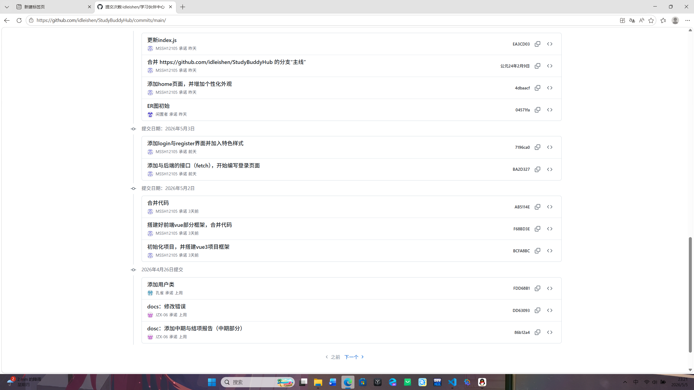
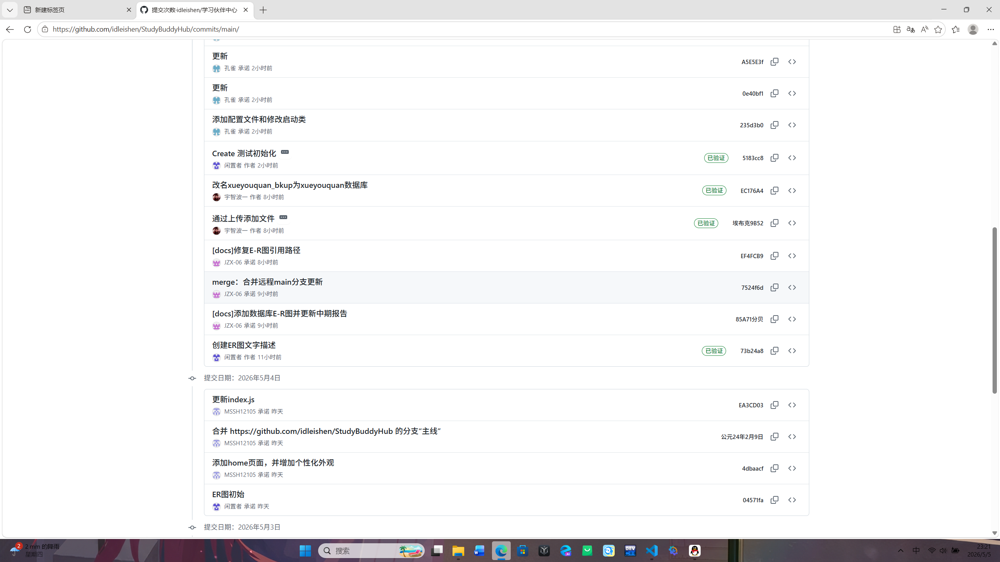
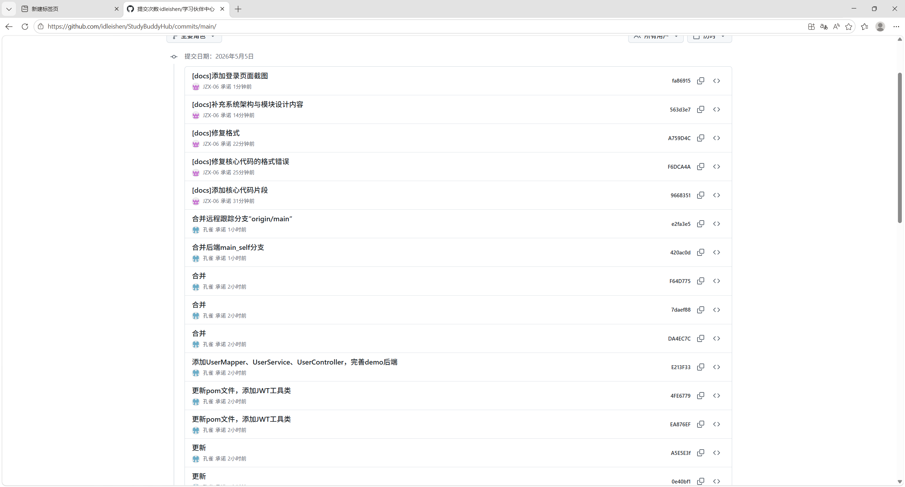
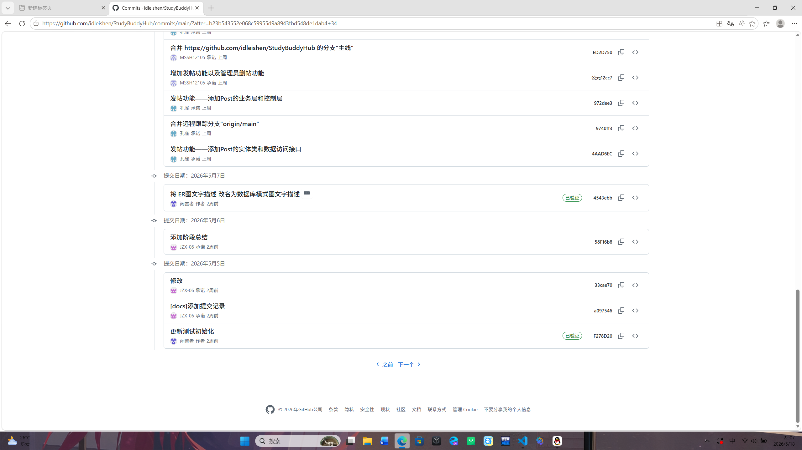
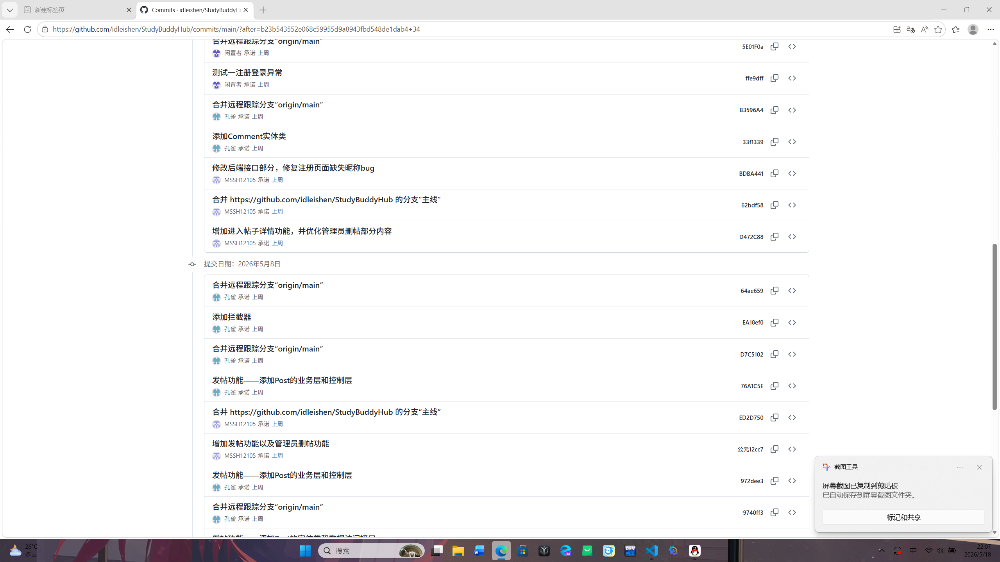
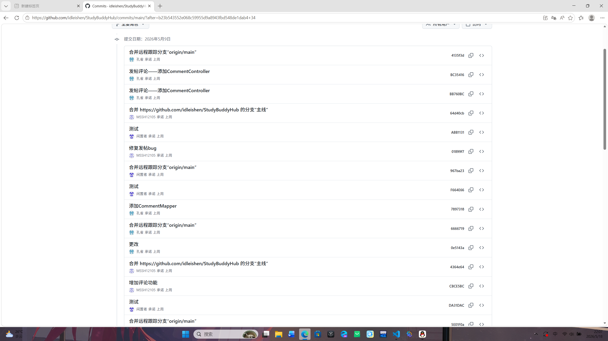
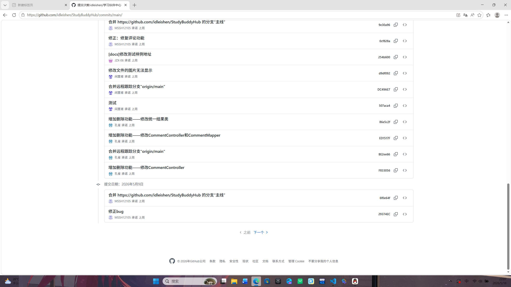
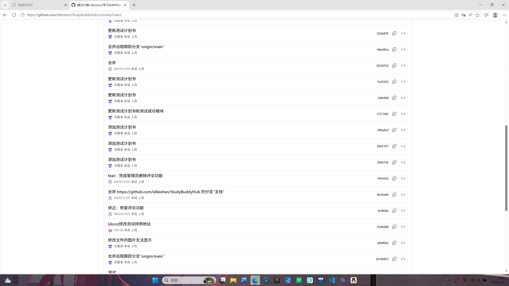
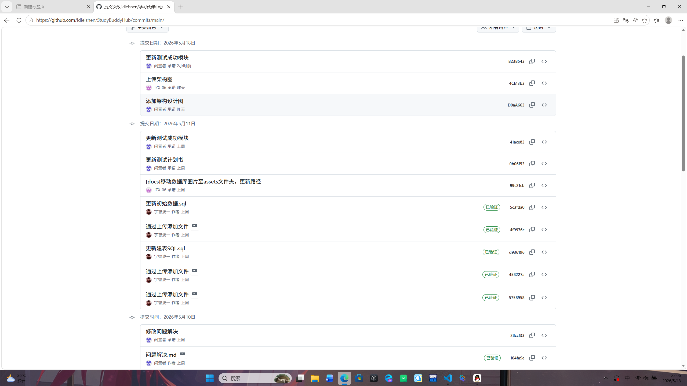


---

## 附录  
- 源代码仓库链接：https://github.com/idleishen/StudyBuddyHub


---
