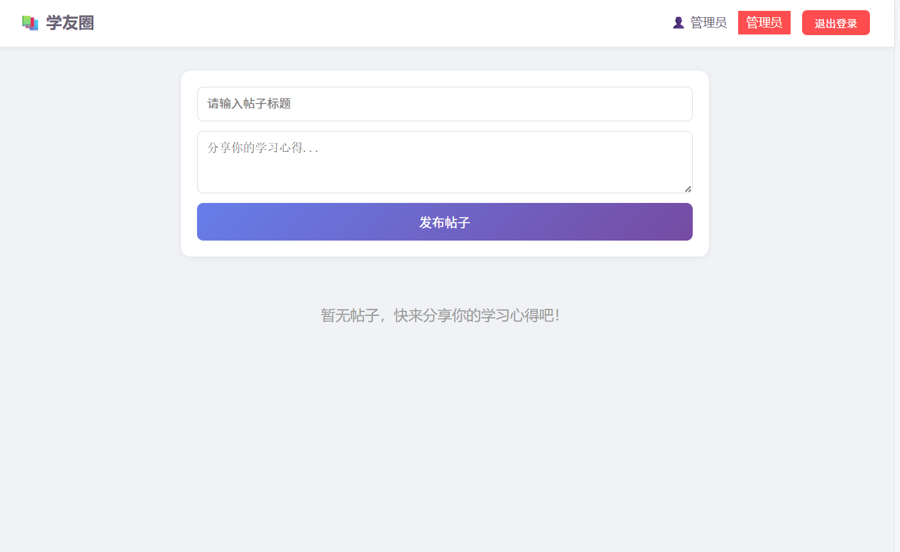
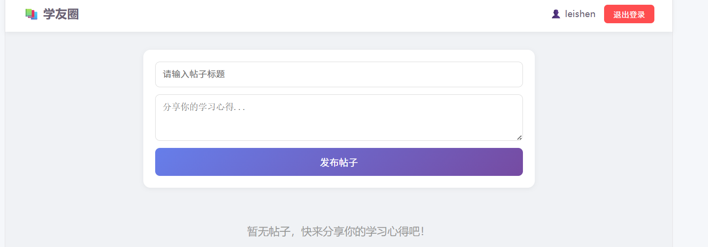
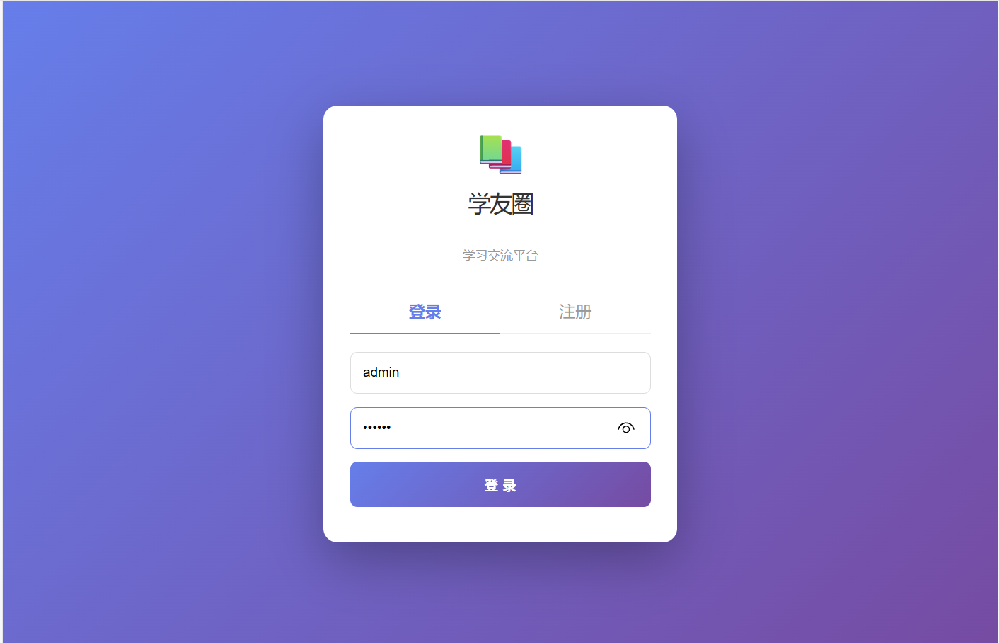
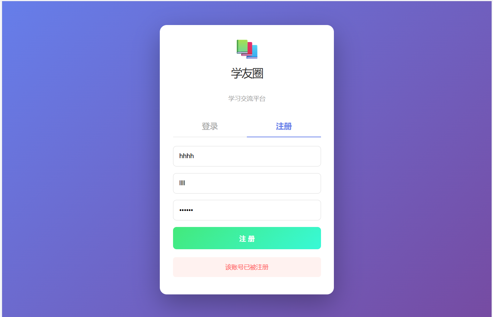
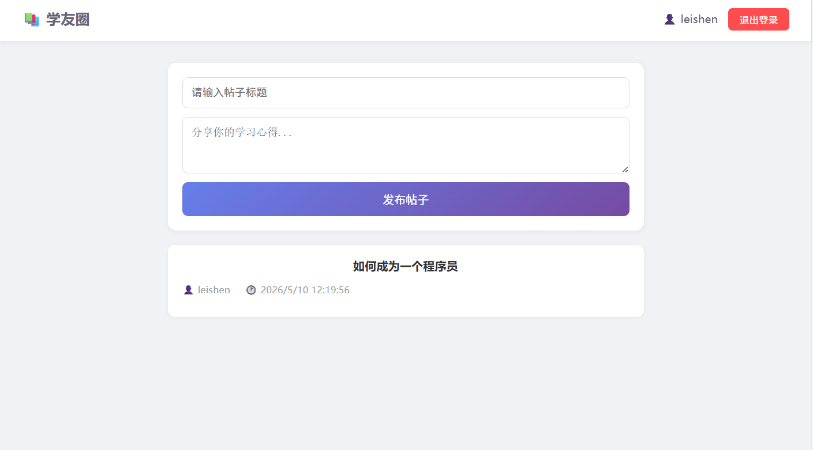
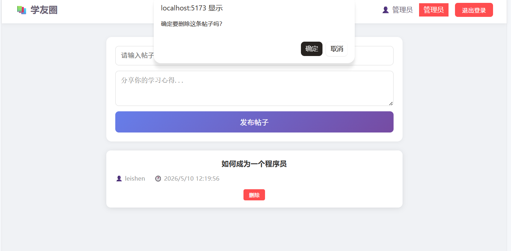
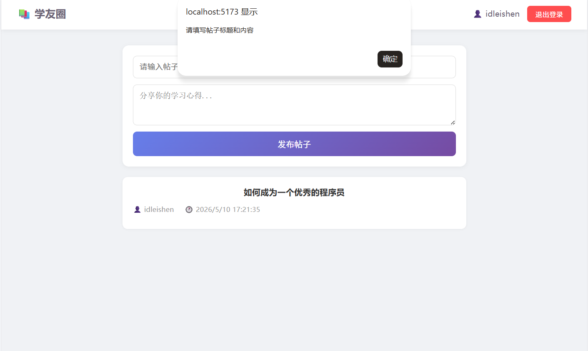
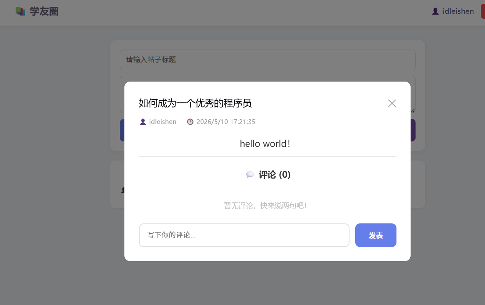
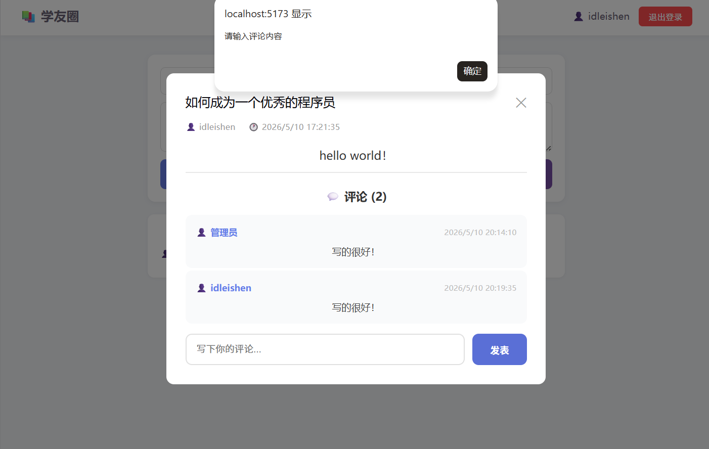

# 测试成功文件

## 测试一用户登陆与注册功能

*登录成功后的界面*

**登录与注册详解**
- *首先登录界面显示的是账号和密码，对于密码空格也会计算在内*
- *其次在注册界面，那个账号是有唯一性的，而昵称是随便的*

## 测试二发帖功能

**发帖详情**
- *首先发帖的标题和正文不能为空，不然会发出提醒*
- *其次对于删除发帖功能可以在表面看见按钮，只有管理员能够看见并删除*

## 测试二评论功能

